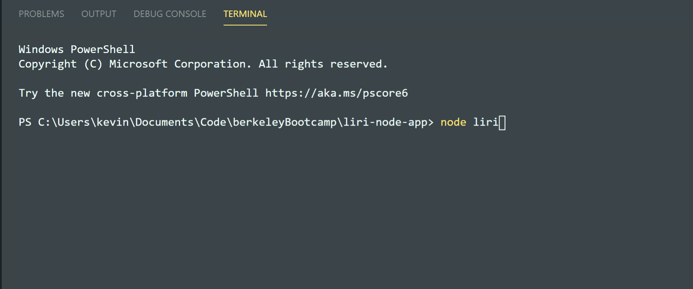

# LIRI Bot

### Overview

Liri Bot is a project from the Berkeley Bootcamp aimed at teaching students the basics of API calls, Node.js, and promise handling, all completely in the terminal. Liri Bot uses either direct command prompts like `node liri movie-this Once upon a time in hollywood`, or uses inqurier to see all the options. 

### APIs

LiriBot uses several APIs:

  * [Node-Spotify-API](https://www.npmjs.com/package/node-spotify-api)
  * [OMDB API](http://www.omdbapi.com) 
  * [Bands In Town API](http://www.artists.bandsintown.com/bandsintown-api)

  LiriBot also uses [DotEnv](https://www.npmjs.com/package/dotenv), [Inquirer](https://www.npmjs.com/package/inquirer), [Axios](https://www.npmjs.com/package/axios),  [Moment](https://www.npmjs.com/package/moment)
   
## Inquirer Guide

Inquirer enables liribot to function like a regular menu system. It can look up concert dates for various artists:

It can read the commands off random.txt. This one says *movie-this There Will Be Blood*.

You can use inquirer to do movie-this instead.

You can look up songs on spotify and return spotify links to tracks.

You can also type in any commands you want without using inquirer like this. 
